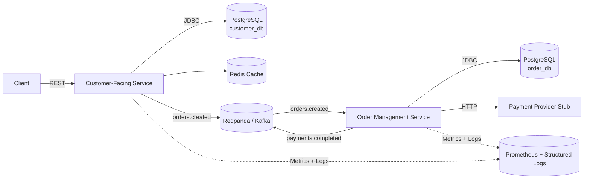

# E-Commerce Platform

> Enterprise-grade, resilience-first commerce stack built for continuous experimentation and operational calm.

## Executive Summary
- Two Spring Boot 3.2 (Java 21) microservices: customer experience on port 8080, order orchestration on port 8081.
- Event-driven backbone via Redpanda/Kafka with transactional outbox, idempotency, and DLQ coverage.
- Production guardrails baked in: TDD workflow, structured logging, Micrometer RED metrics, SLO-aligned health checks.
- Infrastructure delivered through Docker Compose locally, Kubernetes manifests for deployment, and Testcontainers in CI.
- Detailed operational playbooks in `docs/` and automated quickstart validation under `scripts/` keep drift in check.

## Architecture Overview


**Integration contracts**:
- REST APIs documented through Swagger UI per service.
- Kafka topics: `orders.created` (producer: customer service, consumer: order service) and `payments.completed` (producer: payment stub, consumer: order service), each with DLQ.
- Cross-cutting concern propagation: `X-Correlation-ID` traced from ingress to events and logs.

## Key Capabilities
- **Customer Journey**: catalog browsing, cart lifecycle, checkout with idempotency, and order tracking.
- **Operational Safety Nets**: transactional outbox publisher, retry/backoff, DLQ monitoring, and replay guidance.
- **Security Posture**: JWT resource servers, role-aware endpoints (`ROLE_MANAGER` for administrative flows).
- **Observability Discipline**: RED metrics, business KPIs (`orders_created_total`, `checkout_success_total`), Prometheus scraping ready.
- **Compliance with RFC 7807**: uniform error payloads from both services.

## Run It Locally
### 1. Prerequisites
- Java 21 (Temurin recommended)
- Maven 3.8+
- Docker Desktop (8 GB memory allocation)
- `jq` and `curl` for diagnostics

### 2. Bootstrap Infrastructure
```bash
cd infrastructure
docker-compose up -d
docker-compose ps

# Provision Kafka topics once containers are healthy
chmod +x kafka/create-topics.sh
./kafka/create-topics.sh
```

### 3. Build Services
```bash
mvn -T4 clean install -DskipTests
```

### 4. Launch Applications (dev profile)
```bash
# Terminal 1
cd customer-facing-service
mvn spring-boot:run -Dspring-boot.run.profiles=dev

# Terminal 2
cd order-management-service
mvn spring-boot:run -Dspring-boot.run.profiles=dev
```

### 5. Validate Startup
```bash
curl -H "X-Correlation-ID: local-smoke" http://localhost:8080/actuator/health
curl -H "X-Correlation-ID: local-smoke" http://localhost:8081/actuator/health
```

## Quality Gates & Testing
- **Contract + Unit Tests**: `mvn test`
- **Integration Tests (Testcontainers)**: `mvn verify`
- **Static Analysis**: `mvn -Pci verify sonar:sonar`
- **Quickstart Flow Smoke**: `scripts/validate-quickstart.sh` (sets up data, drives checkout, asserts order completion)

Testing adheres to the repository constitution: write failing tests first, then implement; keep diffs tight; document behavioral shifts alongside code.

## Deployment Playbook
1. Build OCI images: `mvn -Pprod clean package jib:dockerBuild`
2. Publish charts/manifests (see `infrastructure/k8s/` when available) with environment-specific overlays.
3. Configure external secrets (`DATABASE_URL`, `JWT_SECRET`, etc.) via your secret manager.
4. Roll out using progressive delivery (e.g., Argo Rollouts) with health and metric-based guards.
5. Run `scripts/validate-quickstart.sh --target remote` against the deployed endpoint to confirm the golden path.

## Observability & Operations
- Metrics endpoint: `/actuator/prometheus` on both services.
- Health probes: `/actuator/health`, `/actuator/health/liveness`, `/actuator/health/readiness`.
- Logs: JSON structured, correlation ID in the `correlationId` field.
- Runbook: `docs/runbook.md` summarises alert responses, dashboards, and recovery scripts.

Prometheus/Grafana configuration templates live under `infrastructure/prometheus/` and `infrastructure/grafana/` once those tasks are implemented.

## Troubleshooting Cheatsheet
- **Kafka consumer lag**: inspect via `docker exec -it redpanda rpk group describe order-service-group` and follow runbook remediation.
- **Circuit breaker open**: check `/actuator/health` details and payment gateway reachability; monitor `resilience4j_circuitbreaker_state` metric.
- **Idempotency conflicts**: verify the `CheckoutIdempotency` table; ensure clients reuse the `Idempotency-Key` header.
- **Database migrations**: check Flyway history via `SELECT * FROM flyway_schema_history;` in each database.
- **Cross-service tracing gaps**: confirm `X-Correlation-ID` header flows end-to-end using logs and events.

## Reference Materials
- `specs/001-e-commerce-platform/spec.md` — canonical requirements.
- `specs/001-e-commerce-platform/plan.md` — delivery plan and sequencing.
- `specs/001-e-commerce-platform/data-model.md` — domain schema.
- `specs/001-e-commerce-platform/contracts/` — REST and event contracts.
- `docs/runbook.md` — operational response guidance.
- `specs/001-e-commerce-platform/tasks.md` — task register with current status.

## Governance
- Development follows the AGENTS constitution (`AGENTS.md`) with explicit roles across product, architecture, implementation, QA, and operations.
- Java 21 is the supported baseline across build, CI, and runtime; avoid 22+ features or toolchain flags.
- Annotation processing remains disabled for tests unless explicitly required to maintain deterministic pipelines.

## Contact
Maintainers coordinate via the Implementation Agent. Raise issues via the task register or open an ADR under `docs/adrs/` for material decisions.
